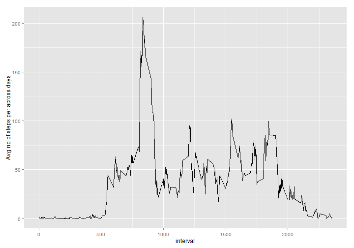

# Reproducible Research: Peer Assessment 1


## Loading and preprocessing the data  

Loading the acrivity data in the variable called data. The data is loaded as is with no conversion while reading. A summary of data is printed.   It is assumed that activity.csv is in the same directory which is used by knitr.  


```r
data <- read.csv("activity.csv", as.is=T)
data$date <- strptime(data$date, "%Y-%m-%d")
summary(data)
```

```
##      steps            date               interval   
##  Min.   :  0.0   Min.   :2012-10-01   Min.   :   0  
##  1st Qu.:  0.0   1st Qu.:2012-10-16   1st Qu.: 589  
##  Median :  0.0   Median :2012-10-31   Median :1178  
##  Mean   : 37.4   Mean   :2012-10-31   Mean   :1178  
##  3rd Qu.: 12.0   3rd Qu.:2012-11-15   3rd Qu.:1766  
##  Max.   :806.0   Max.   :2012-11-30   Max.   :2355  
##  NA's   :2304
```

## What is mean total number of steps taken per day? 

Plotting total number of steps per day as a histogram. ddply function in the plyr package is used to summarize the data based on date and total is taken as sum of steps for a given date. ggplot2 graphics system is used to plot the histogram, stat parameter is set to identity so that y value is taken as heigt of histogram, in this case y being total.  


```r
library(ggplot2)
library(plyr)
with(ddply(data, .(date),summarize, total=sum(steps, na.rm = T)), qplot(date,total, geom=c("bar"), stat="identity", xlab="Date", ylab="Total Steps"))
```

 


```r
mean <- with(ddply(data, .(date),summarize, total=sum(steps)), mean(total, na.rm = T))
median <- with(ddply(data, .(date),summarize, total=sum(steps)), median(total, na.rm = T))
```
The mean total number of steps taken per day are **1.0766 &times; 10<sup>4</sup>** and median number of steps taken per day are **10765**  
  
## What is the average daily activity pattern?
Plotting a time series plot of total steps taken per interval. ggplot plotting system is used with line geom.  ddply is applied to calculate mean for each interval across dates.  


```r
with(ddply(data, .(interval), summarize, total = mean(steps, na.rm = T)), qplot(interval, total, geom=c("line"), ylab="Avg no of steps per across days"))
```

 


```r
temp <- ddply(data, .(interval), summarize, total = mean(steps, na.rm = T))
maxInterval <- temp[which.max(temp$total),1]
```
Interval with maximum number of steps taken is 835 interval  
  
  
## Imputing missing values

Computing total number of missing values. Since a quick look at summary of data shows that missing values are only in the step column, doing an is.na check on the column and computing the length where the is.na is True will give the result


```r
missingValues <- length(which(is.na(data$steps)))
```
There are **2304** rows with missing values   
  
For imputing the missing values I will use the mean number of steps for a given interval across all dates as we computed above. I first join the temporary data containing mean and interval to the original using on the interval column. Next where ever the number of steps are NA, I used the value in total column to replace it and finally i drop the total column.
  

```r
temp <- ddply(data, .(interval), summarize, total = mean(steps, na.rm = T))
imputedData <- join(data,temp, by="interval")
imputedData[is.na(imputedData$steps),"steps"] <- imputedData[is.na(imputedData$steps),"total"]
imputedData$total <- NULL
imputedmean <- with(ddply(imputedData, .(date),summarize, total=sum(steps)), mean(total, na.rm = T))
imputedmedian <- with(ddply(imputedData, .(date),summarize, total=sum(steps)), median(total, na.rm = T))
with(ddply(imputedData, .(date),summarize, total=sum(steps, na.rm = T)), qplot(date,total, geom=c("bar"), stat="identity", xlab="Date", ylab="Total Steps"))
```

 
  
  
Mean total number of steps taken per day are **1.0766 &times; 10<sup>4</sup>** and median number of steps taken per day are **1.0766 &times; 10<sup>4</sup>**  

## Are there differences in activity patterns between weekdays and weekends?
  
For creating the factor variable I first use the weekday funtion with abbreviations so that it gives me out put as sun, mon, tues etc. Next I create a factor variable out of it and replace the seven levels with two namely weekday and weekend appropriately.
  
  

```r
imputedData$daytype <- factor(weekdays(imputedData$date, abbreviate = T))
levels(imputedData$daytype) <- c(rep("weekday",2),rep("weekend",2),rep("weekday",3))
plotData <- ddply(imputedData, .(interval, daytype),summarize, mean=mean(steps))
qplot(data=plotData, interval, mean, geom=c("line"), facets = daytype ~ .)
```

 
  
  
